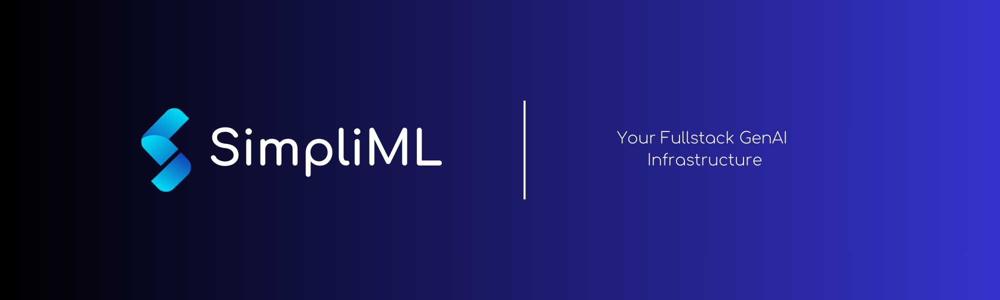

<div align="center">


**Your Full Stack GenAI Infrastructure. Deploy, Finetune, Manage Prompts and Generate Data—all in one place.**

[](https://simpliml.com)
[](./LICENSE)
[](https://join.slack.com/t/simplimlcommunity/shared_invite/zt-2krc7gyhv-bbutCiCDXNYLwC0ls7VMmg)
</div>
<br><br>

## 📋 Table of Contents

- [Introduction](#introduction)
- [Features](#features)
- [Getting Started](#getting-started)
  - [Kubernetes Deployment](#kubernetes-deployment-recommended)
  - [Local Deployment](#local-deployment)
- [SimpliML Structure](#simpliml-structure)
  - [Backend](#backend)
  - [Frontend](#frontend)
  - [Inference Gateway](#inference-gateway)
- [Multi-Cloud Support](#multi-cloud-support)
- [Documentation](#documentation)
- [Contributing](#contributing)
- [License](#license)

## 🌟 Introduction

SimpliML is an open-source project designed to streamline the process of building, training, and deploying machine learning models. Our mission is to lower the barriers to entry in the field of Generative AI (GenAI) and empower users with intuitive tools and comprehensive documentation.

SimpliML offers a user-friendly interface and extensive resources, making it an excellent choice for both beginners and seasoned professionals.

## ✨ Features

- **🚀 Deployment**: Deploy your models effortlessly, with zero coding required. Enjoy blazing-fast inference without the hassle of managing infrastructure or autoscaling. Choose from a variety of servers like vllm, tgi, triton, and more.
- **🎯 Finetuning**: Enhance your model's performance by fine-tuning it with your data. Our robust infrastructure manages multiple GPUs and nodes seamlessly, ensuring an efficient process.
- **📜 Prompt Store**: Easily craft, manage, and version your prompts with our prompt management feature, available across all models on our platform. Experiment with these prompts using our interactive user interface before deploying them to production.
- **📊 Logging**: Gain real-time insights into the cost, latency, and accuracy of your requests. Our comprehensive logging system records every request and response, enabling you to monitor, debug, and use logs for continuous model improvement.
- **🌐 Community Support**: Benefit from an active community for troubleshooting and collaboration.

## Getting Started

### ☸️ Kubernetes Deployment (Recommended)
**NOTE**: SimpliML requires Kubernetes for deployment. Kubernetes provides the necessary orchestration and scaling capabilities to manage the infrastructure efficiently. Ensure you have a Kubernetes cluster set up before deploying SimpliML.

### 🖥️ Local Deployment
To get started with SimpliML, the easiest way is using Docker:

1. Copy the `.env.example` file to `.env`:

    ```bash
    cp .env.example .env
    ```

2. Update the values in the `.env` file according to your setup.

3. Repeat steps 1 and 2 for the `backend` and `inference-gateway` directories:

    ```bash
    cd backend-server
    cp .env.example .env
    # Update .env file with appropriate values

    cd inference-gateway
    cp .env.example .env
    # Update .env file with appropriate values
    ```

4. Run the following command in your terminal:

    ```bash
    docker compose up -d
    ```
`Access the application at http://localhost:3000`

**NOTE**: Local deployment will only set up the database, backend, and frontend servers. Model deployment and finetuning will take place in Kubernetes only.

## 🏗️ SimpliML Structure

SimpliML's infrastructure is built on three major components:

### 🔧 Backend

The backend is the core API server that handles requests, processes data, and manages the interaction between various components. Built in pure TypeScript, the backend is designed for performance, scalability, and ease of maintenance.

- **Directory**: `backend-server`
- **Main Features**:
  - RESTful API endpoints for model management, deployment, and monitoring.
  - User authentication and authorization.
  - Database management and interactions.

Follow the [README.md](/backend-server/README.md) in the `backend-server` directory for detailed setup instructions from source.

### 🌐 Frontend

The frontend is a web application built with Next.js, providing an intuitive and interactive user interface for managing models, prompts, and other features of SimpliML.

- **Directory**: `frontend`
- **Main Features**:
  - User-friendly dashboards and interfaces for managing deployments, finetuning, and prompt stores.
  - Real-time monitoring and logging views.
  - Integration with backend APIs for seamless data interaction.

Follow the [README.md](/frontend/README.md) in the `frontend` directory for detailed setup instructions from source.

### ⚙️ Inference Gateway

The inference gateway is responsible for managing inference requests, providing a scalable and efficient way to handle model predictions. Built in pure TypeScript, it ensures high performance and reliability.

- **Directory**: `inference-gateway`
- **Main Features**:
  - Handles inference requests and routes them to the appropriate model.
  - Manages load balancing and scaling for inference tasks.
  - Provides APIs for real-time inference and batch processing.

Follow the [README.md](/inference-gateway/README.md) in the `inference-gateway` directory for detailed setup instructions from source.

## 🌐 SimpliML (SaaS)

For users looking for a managed solution, SimpliML Manager offers a Managed SaaS version. With managed version, you can:

- Access a fully managed infrastructure without the need to handle Kubernetes or cloud configurations.
- Enjoy automated scaling, monitoring, and maintenance.
- Benefit from premium support and advanced features exclusive to the SaaS offering.

Learn more and sign up to SimpliML [here](https://simpliml.com).

## ☁️ Multi-Cloud Support
SimpliML is designed to support multi-cloud deployments using Kubernetes. Kubernetes provides the necessary orchestration and scaling capabilities, allowing you to deploy SimpliML across various cloud providers seamlessly. Whether you're using AWS, Google Cloud Platform (GCP), Azure, or any other cloud service, SimpliML's infrastructure can be easily configured to suit your needs.

## 📚 Documentation

Detailed documentation is available to help you navigate and utilize all the features of SimpliML. Please refer to the [Documentation](https://docs.simpliml.com) for more information.

## 🤝 Contributing

We welcome contributions from the community! If you're interested in contributing to SimpliML, please read our [Contributing Guide](CONTRIBUTING.md) to get started.

## 📄 License

SimpliML is licensed under the [Apache 2.0 License](LICENSE). You are free to use, modify, and distribute this software according to the terms of the license.

---

Thank you for choosing SimpliML! We hope you find it valuable in your machine learning journey. If you have any questions or feedback, please don't hesitate to reach out at [support@simpliml.com](mailto:support@simpliml.com).